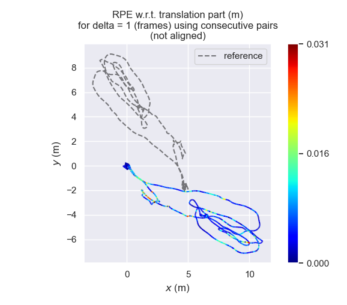
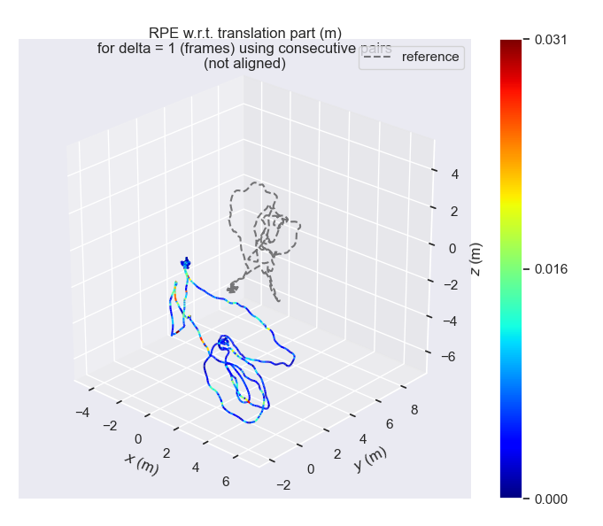
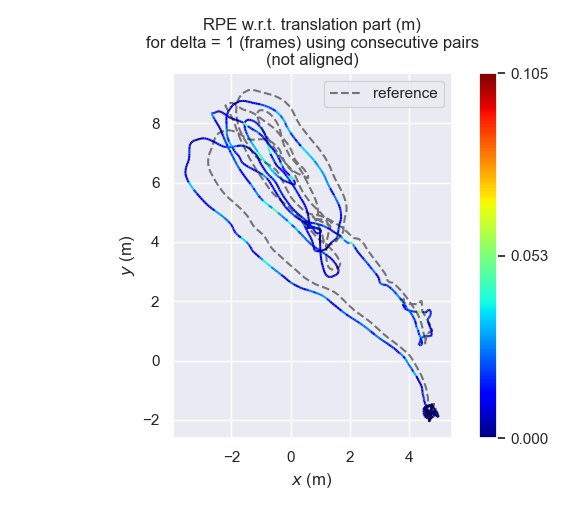
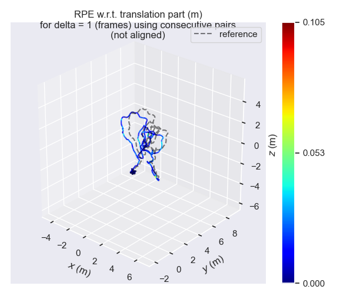

# Convert Coordinate Local to Global frame !

**[Goal] In order to calculate RMSE, we must change coordinate from local to global !!** 

## 1. Dependencies
- OpenCV & Eigen

## 2. Compare Global Coordinate to Local Coordinate (Not convert to global)
 <table>
    <tr>
       <td> Not convert (xy)</td>
       <td> Not convert (xyz) </td>
    </tr> 
    <tr>
       <td> </td>
       <td> </td>
    </tr>
 </table>
   
## 3. Compare Global Coordinate to Local Coordinate (Convert to global)
 <table>
    <tr>
       <td> Convert (xy)</td>
       <td> Convert (xyz) </td>
    </tr> 
    <tr>
       <td> </td>
       <td> </td>
    </tr>
 </table>
